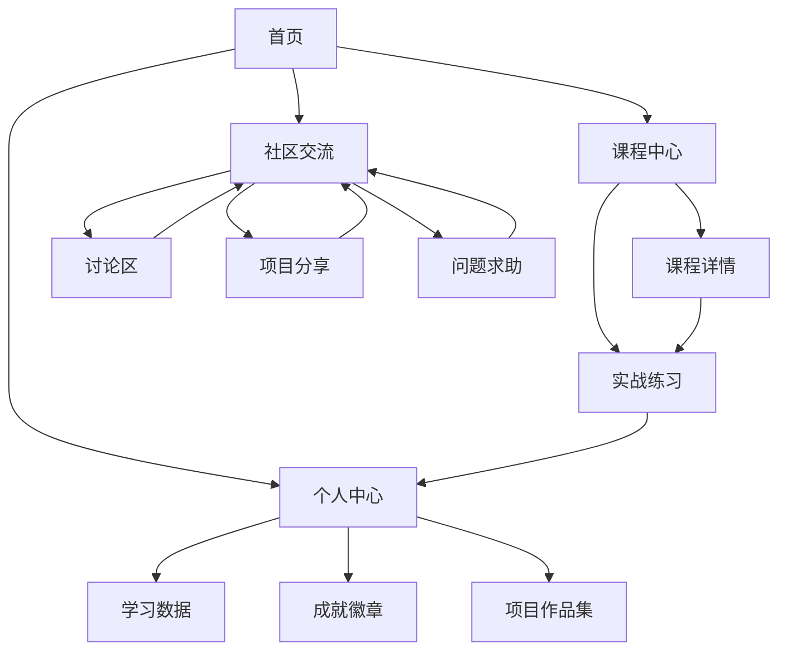

## 1. Product Overview
Python学习社区平台，专注于商务数据分析专业，提供完整课程体系和互动学习生态。
- 为商务数据分析专业学生和从业者提供学习、实践和交流的综合平台
- 目标是构建一个连接师生、学长学姐与行业从业者的专业社群，促进知识共享和职业发展

## 2. Core Features

### 2.1 User Roles
| Role | Registration Method | Core Permissions |
|------|---------------------|------------------|
| 普通用户 | 邮箱注册 | 浏览课程、参与讨论、提交作业 |
| 教师 | 邀请码注册 | 发布课程、批改作业、管理讨论 |
| 行业导师 | 审核注册 | 分享行业经验、提供职业指导 |

### 2.2 Feature Module
1. **首页**：平台介绍、课程推荐、社区动态、用户成就展示
2. **课程中心**：课程列表、课程详情、学习进度、实战练习
3. **社区交流**：讨论区、项目分享、问题求助、行业话题
4. **个人中心**：学习数据、成就徽章、项目作品集、个人资料

### 2.3 Page Details
| Page Name | Module Name | Feature description |
|-----------|-------------|---------------------|
| 首页 | 英雄区 | 平台介绍、核心价值展示、注册/登录入口 |
| 首页 | 课程推荐 | 热门课程、推荐课程、最新课程展示 |
| 首页 | 社区动态 | 最新讨论、热门项目、行业资讯 |
| 首页 | 成就展示 | 用户学习成就、排行榜 |
| 课程中心 | 课程列表 | 分类筛选、搜索功能、学习进度显示 |
| 课程中心 | 课程详情 | 课程内容、视频/文档、实战练习、评论 |
| 课程中心 | 实战练习 | 编程挑战、数据分析任务、自动评测 |
| 社区交流 | 讨论区 | 分类讨论、话题发布、回复互动 |
| 社区交流 | 项目分享 | 项目展示、代码分享、反馈评论 |
| 社区交流 | 问题求助 | 技术问题、学习疑惑、专家解答 |
| 个人中心 | 学习数据 | 学习时长、完成课程、技能图谱 |
| 个人中心 | 成就徽章 | 获得徽章、解锁条件、展示分享 |
| 个人中心 | 项目作品集 | 个人项目、团队项目、行业评价 |

## 3. Core Process
### 主要用户流程
1. **新用户注册**：选择用户类型 → 填写信息 → 验证邮箱 → 完成注册
2. **课程学习**：浏览课程 → 选择课程 → 观看视频/阅读文档 → 完成练习 → 提交作业
3. **社区互动**：浏览讨论 → 发布话题/问题 → 参与讨论 → 获得反馈
4. **项目分享**：创建项目 → 上传代码/文档 → 分享到社区 → 获得评价

## 4. User Interface Design
### 4.1 Design Style
- 主色调：深蓝色 (#1a365d) 和湖蓝色 (#2b6cb0)
- 辅助色：橙色 (#ed8936) 用于强调和交互元素
- 按钮样式：圆角矩形，带有轻微的阴影效果
- 字体：无衬线字体，主标题使用较大字号，内容使用清晰易读的字号
- 布局风格：卡片式布局，顶部导航栏，响应式设计
- 图标风格：简洁现代的线性图标，配合功能使用

### 4.2 Page Design Overview
| Page Name | Module Name | UI Elements |
|-----------|-------------|-------------|
| 首页 | 英雄区 | 大型背景图片，渐变叠加，清晰的标题和副标题，行动号召按钮 |
| 首页 | 课程推荐 | 卡片式布局，课程封面图，课程名称，难度等级，学习人数 |
| 首页 | 社区动态 | 时间线形式，最新活动，用户头像，简短描述 |
| 首页 | 成就展示 | 徽章墙，排行榜，用户头像和名称，成就点数 |
| 课程中心 | 课程列表 | 网格布局，筛选侧边栏，搜索框，分页控件 |
| 课程中心 | 课程详情 | 视频播放器，课程大纲，进度条，评论区 |
| 课程中心 | 实战练习 | 代码编辑器，任务描述，提交按钮，评测结果 |
| 社区交流 | 讨论区 | 话题列表，分类标签，发帖按钮，回复数显示 |
| 社区交流 | 项目分享 | 项目卡片，缩略图，技术栈标签，点赞评论数 |
| 社区交流 | 问题求助 | 问题列表，标签筛选，解决状态，回答数 |
| 个人中心 | 学习数据 | 数据图表，进度条，技能雷达图 |
| 个人中心 | 成就徽章 | 徽章网格，解锁状态，获取条件 |
| 个人中心 | 项目作品集 | 项目卡片，详情链接，技术栈，评价星级 |

### 4.3 Responsiveness
- 采用移动优先的响应式设计
- 桌面端：多列布局，充分利用屏幕空间
- 平板端：适当调整布局，保持核心功能可见
- 移动端：单列布局，简化导航为汉堡菜单，优化触控体验

### 4.4 3D Scene Guidance
- 不适用，本项目为2D网页应用