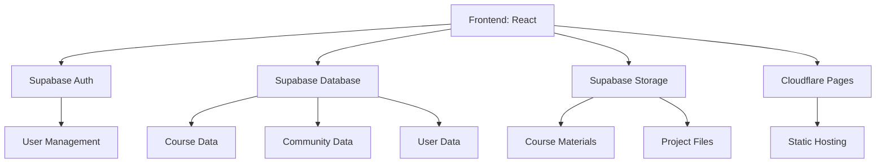
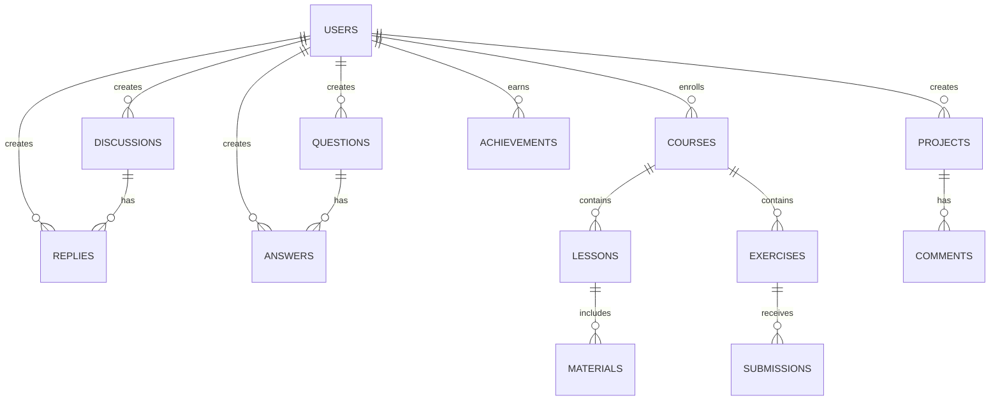

## 1. Architecture Design


## 2. Technology Description
- Frontend: React@18 + TypeScript + Tailwind CSS@3 + Vite
- Initialization Tool: vite-init
- Backend: Supabase (Authentication, Database, Storage)
- Database: Supabase (PostgreSQL)
- Hosting: Cloudflare Pages
- State Management: Zustand
- UI Components: Custom components + Lucide icons
- Charting: Recharts (for data visualization)
- Code Editor: Monaco Editor (for practice exercises)

## 3. Route Definitions
| Route | Purpose |
|-------|---------|
| / | 首页 |
| /courses | 课程列表 |
| /courses/:id | 课程详情 |
| /courses/:id/exercises/:exerciseId | 实战练习 |
| /community | 社区交流首页 |
| /community/discussions | 讨论区 |
| /community/projects | 项目分享 |
| /community/questions | 问题求助 |
| /profile | 个人中心 |
| /profile/learning | 学习数据 |
| /profile/achievements | 成就徽章 |
| /profile/projects | 项目作品集 |
| /auth/login | 登录页 |
| /auth/register | 注册页 |

## 4. API Definitions
### Supabase Client SDK Usage
- Authentication: Sign up, sign in, sign out, password reset
- Database: CRUD operations for courses, discussions, projects, etc.
- Storage: Upload and download course materials, project files

## 5. Server Architecture Diagram
- 不适用，使用Supabase作为无服务器后端

## 6. Data Model
### 6.1 Data Model Definition


### 6.2 Data Definition Language
```sql
-- Users Table
CREATE TABLE users (
  id UUID PRIMARY KEY,
  email TEXT UNIQUE NOT NULL,
  name TEXT NOT NULL,
  role TEXT NOT NULL DEFAULT 'student', -- student, teacher, industry_mentor
  avatar_url TEXT,
  bio TEXT,
  created_at TIMESTAMP WITH TIME ZONE DEFAULT NOW()
);

-- Courses Table
CREATE TABLE courses (
  id UUID PRIMARY KEY,
  title TEXT NOT NULL,
  description TEXT NOT NULL,
  cover_image TEXT,
  difficulty TEXT NOT NULL, -- beginner, intermediate, advanced
  category TEXT NOT NULL,
  created_by UUID REFERENCES users(id),
  created_at TIMESTAMP WITH TIME ZONE DEFAULT NOW(),
  updated_at TIMESTAMP WITH TIME ZONE DEFAULT NOW()
);

-- Course Enrollments Table
CREATE TABLE course_enrollments (
  id UUID PRIMARY KEY,
  user_id UUID REFERENCES users(id),
  course_id UUID REFERENCES courses(id),
  progress INTEGER DEFAULT 0, -- percentage
  enrolled_at TIMESTAMP WITH TIME ZONE DEFAULT NOW(),
  UNIQUE(user_id, course_id)
);

-- Lessons Table
CREATE TABLE lessons (
  id UUID PRIMARY KEY,
  course_id UUID REFERENCES courses(id),
  title TEXT NOT NULL,
  content TEXT NOT NULL,
  order_index INTEGER NOT NULL,
  created_at TIMESTAMP WITH TIME ZONE DEFAULT NOW()
);

-- Exercise Table
CREATE TABLE exercises (
  id UUID PRIMARY KEY,
  course_id UUID REFERENCES courses(id),
  title TEXT NOT NULL,
  description TEXT NOT NULL,
  difficulty TEXT NOT NULL,
  solution_hint TEXT,
  created_at TIMESTAMP WITH TIME ZONE DEFAULT NOW()
);

-- Submissions Table
CREATE TABLE submissions (
  id UUID PRIMARY KEY,
  user_id UUID REFERENCES users(id),
  exercise_id UUID REFERENCES exercises(id),
  code TEXT NOT NULL,
  result TEXT,
  score INTEGER,
  submitted_at TIMESTAMP WITH TIME ZONE DEFAULT NOW()
);

-- Discussions Table
CREATE TABLE discussions (
  id UUID PRIMARY KEY,
  user_id UUID REFERENCES users(id),
  title TEXT NOT NULL,
  content TEXT NOT NULL,
  category TEXT NOT NULL,
  likes INTEGER DEFAULT 0,
  created_at TIMESTAMP WITH TIME ZONE DEFAULT NOW()
);

-- Replies Table
CREATE TABLE replies (
  id UUID PRIMARY KEY,
  discussion_id UUID REFERENCES discussions(id),
  user_id UUID REFERENCES users(id),
  content TEXT NOT NULL,
  likes INTEGER DEFAULT 0,
  created_at TIMESTAMP WITH TIME ZONE DEFAULT NOW()
);

-- Projects Table
CREATE TABLE projects (
  id UUID PRIMARY KEY,
  user_id UUID REFERENCES users(id),
  title TEXT NOT NULL,
  description TEXT NOT NULL,
  github_url TEXT,
  demo_url TEXT,
  tags TEXT[],
  likes INTEGER DEFAULT 0,
  created_at TIMESTAMP WITH TIME ZONE DEFAULT NOW()
);

-- Project Comments Table
CREATE TABLE project_comments (
  id UUID PRIMARY KEY,
  project_id UUID REFERENCES projects(id),
  user_id UUID REFERENCES users(id),
  content TEXT NOT NULL,
  created_at TIMESTAMP WITH TIME ZONE DEFAULT NOW()
);

-- Questions Table
CREATE TABLE questions (
  id UUID PRIMARY KEY,
  user_id UUID REFERENCES users(id),
  title TEXT NOT NULL,
  content TEXT NOT NULL,
  tags TEXT[],
  is_solved BOOLEAN DEFAULT FALSE,
  created_at TIMESTAMP WITH TIME ZONE DEFAULT NOW()
);

-- Answers Table
CREATE TABLE answers (
  id UUID PRIMARY KEY,
  question_id UUID REFERENCES questions(id),
  user_id UUID REFERENCES users(id),
  content TEXT NOT NULL,
  is_accepted BOOLEAN DEFAULT FALSE,
  likes INTEGER DEFAULT 0,
  created_at TIMESTAMP WITH TIME ZONE DEFAULT NOW()
);

-- Achievements Table
CREATE TABLE achievements (
  id UUID PRIMARY KEY,
  name TEXT NOT NULL,
  description TEXT NOT NULL,
  icon TEXT NOT NULL,
  requirement TEXT NOT NULL
);

-- User Achievements Table
CREATE TABLE user_achievements (
  id UUID PRIMARY KEY,
  user_id UUID REFERENCES users(id),
  achievement_id UUID REFERENCES achievements(id),
  earned_at TIMESTAMP WITH TIME ZONE DEFAULT NOW(),
  UNIQUE(user_id, achievement_id)
);

-- Grants
GRANT SELECT ON ALL TABLES IN SCHEMA public TO anon;
GRANT ALL PRIVILEGES ON ALL TABLES IN SCHEMA public TO authenticated;

-- RLS Policies
ALTER TABLE users ENABLE ROW LEVEL SECURITY;
CREATE POLICY "Users can view their own profile" ON users FOR SELECT USING (auth.uid() = id);
CREATE POLICY "Users can update their own profile" ON users FOR UPDATE USING (auth.uid() = id);

ALTER TABLE courses ENABLE ROW LEVEL SECURITY;
CREATE POLICY "Public can view courses" ON courses FOR SELECT USING (true);
CREATE POLICY "Teachers can create courses" ON courses FOR INSERT WITH CHECK (auth.jwt() ->> 'role' = 'teacher');
CREATE POLICY "Teachers can update their courses" ON courses FOR UPDATE USING (auth.uid() = created_by);

ALTER TABLE course_enrollments ENABLE ROW LEVEL SECURITY;
CREATE POLICY "Users can view their own enrollments" ON course_enrollments FOR SELECT USING (auth.uid() = user_id);
CREATE POLICY "Users can enroll in courses" ON course_enrollments FOR INSERT WITH CHECK (auth.uid() = user_id);
CREATE POLICY "Users can update their own enrollments" ON course_enrollments FOR UPDATE USING (auth.uid() = user_id);
```