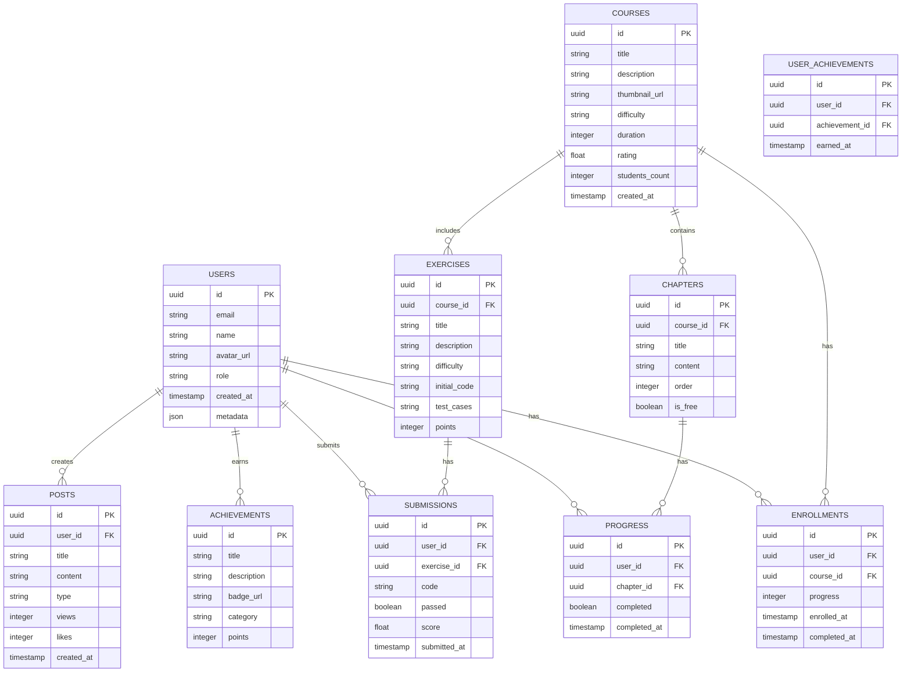

## 1. Architecture Design
```mermaid
graph TB
    subgraph Frontend["前端层 (React + Vite)"]
        Pages["页面组件"]
        Components["UI组件"]
        State["状态管理 (Zustand)"]
        Router["路由 (React Router)"]
    end
    
    subgraph Data["数据层 (Supabase)"]
        Auth["用户认证"]
        DB[(PostgreSQL数据库)]
        Storage["文件存储"]
    end
    
    Frontend --&gt; Data
```

## 2. Technology Description
- **前端**: React@18 + TypeScript + TailwindCSS@3 + Vite
- **UI组件**: Lucide-react图标库 + Monaco代码编辑器
- **状态管理**: Zustand
- **路由**: React Router DOM@7
- **后端服务**: Supabase (认证、数据库、存储)
- **部署**: Cloudflare Pages

## 3. Route Definitions
| Route | Purpose |
|-------|---------|
| / | 首页 |
| /courses | 课程列表 |
| /courses/:id | 课程详情 |
| /practice | 实战练习 |
| /practice/:id | 练习详情 |
| /achievements | 成就系统 |
| /community | 社区交流 |
| /profile | 个人中心 |
| /login | 登录 |
| /register | 注册 |
| /assessment | 能力评估 |
| /assessment/:id | 评估详情 |

## 4. Data Model

### 4.1 Data Model Definition


### 4.2 Data Definition Language
```sql
-- 用户表
CREATE TABLE users (
    id UUID PRIMARY KEY DEFAULT gen_random_uuid(),
    email TEXT UNIQUE NOT NULL,
    name TEXT NOT NULL,
    avatar_url TEXT,
    role TEXT DEFAULT 'student' CHECK (role IN ('student', 'teacher', 'professional')),
    created_at TIMESTAMPTZ DEFAULT NOW(),
    metadata JSONB DEFAULT '{}'
);

-- 课程表
CREATE TABLE courses (
    id UUID PRIMARY KEY DEFAULT gen_random_uuid(),
    title TEXT NOT NULL,
    description TEXT,
    thumbnail_url TEXT,
    difficulty TEXT DEFAULT 'beginner' CHECK (difficulty IN ('beginner', 'intermediate', 'advanced')),
    duration INTEGER,
    rating FLOAT DEFAULT 0,
    students_count INTEGER DEFAULT 0,
    created_at TIMESTAMPTZ DEFAULT NOW()
);

-- 章节表
CREATE TABLE chapters (
    id UUID PRIMARY KEY DEFAULT gen_random_uuid(),
    course_id UUID NOT NULL,
    title TEXT NOT NULL,
    content TEXT,
    "order" INTEGER NOT NULL,
    is_free BOOLEAN DEFAULT FALSE,
    created_at TIMESTAMPTZ DEFAULT NOW()
);

-- 练习表
CREATE TABLE exercises (
    id UUID PRIMARY KEY DEFAULT gen_random_uuid(),
    course_id UUID NOT NULL,
    title TEXT NOT NULL,
    description TEXT,
    difficulty TEXT DEFAULT 'beginner',
    initial_code TEXT,
    test_cases TEXT,
    points INTEGER DEFAULT 10,
    created_at TIMESTAMPTZ DEFAULT NOW()
);

-- 报名表
CREATE TABLE enrollments (
    id UUID PRIMARY KEY DEFAULT gen_random_uuid(),
    user_id UUID NOT NULL,
    course_id UUID NOT NULL,
    progress INTEGER DEFAULT 0,
    enrolled_at TIMESTAMPTZ DEFAULT NOW(),
    completed_at TIMESTAMPTZ,
    UNIQUE(user_id, course_id)
);

-- 进度表
CREATE TABLE progress (
    id UUID PRIMARY KEY DEFAULT gen_random_uuid(),
    user_id UUID NOT NULL,
    chapter_id UUID NOT NULL,
    completed BOOLEAN DEFAULT FALSE,
    completed_at TIMESTAMPTZ,
    UNIQUE(user_id, chapter_id)
);

-- 提交表
CREATE TABLE submissions (
    id UUID PRIMARY KEY DEFAULT gen_random_uuid(),
    user_id UUID NOT NULL,
    exercise_id UUID NOT NULL,
    code TEXT,
    passed BOOLEAN DEFAULT FALSE,
    score FLOAT DEFAULT 0,
    submitted_at TIMESTAMPTZ DEFAULT NOW()
);

-- 成就表
CREATE TABLE achievements (
    id UUID PRIMARY KEY DEFAULT gen_random_uuid(),
    title TEXT NOT NULL,
    description TEXT,
    badge_url TEXT,
    category TEXT DEFAULT 'learning',
    points INTEGER DEFAULT 10
);

-- 用户成就表
CREATE TABLE user_achievements (
    id UUID PRIMARY KEY DEFAULT gen_random_uuid(),
    user_id UUID NOT NULL,
    achievement_id UUID NOT NULL,
    earned_at TIMESTAMPTZ DEFAULT NOW(),
    UNIQUE(user_id, achievement_id)
);

-- 帖子表
CREATE TABLE posts (
    id UUID PRIMARY KEY DEFAULT gen_random_uuid(),
    user_id UUID NOT NULL,
    title TEXT NOT NULL,
    content TEXT,
    type TEXT DEFAULT 'question' CHECK (type IN ('question', 'project', 'discussion')),
    views INTEGER DEFAULT 0,
    likes INTEGER DEFAULT 0,
    created_at TIMESTAMPTZ DEFAULT NOW()
);

-- 启用 RLS
ALTER TABLE users ENABLE ROW LEVEL SECURITY;
ALTER TABLE courses ENABLE ROW LEVEL SECURITY;
ALTER TABLE chapters ENABLE ROW LEVEL SECURITY;
ALTER TABLE exercises ENABLE ROW LEVEL SECURITY;
ALTER TABLE enrollments ENABLE ROW LEVEL SECURITY;
ALTER TABLE progress ENABLE ROW LEVEL SECURITY;
ALTER TABLE submissions ENABLE ROW LEVEL SECURITY;
ALTER TABLE achievements ENABLE ROW LEVEL SECURITY;
ALTER TABLE user_achievements ENABLE ROW LEVEL SECURITY;
ALTER TABLE posts ENABLE ROW LEVEL SECURITY;

-- 策略：所有人可读课程
CREATE POLICY "Courses are viewable by everyone" ON courses
    FOR SELECT USING (true);

-- 策略：认证用户可读所有公开数据
CREATE POLICY "Authenticated users can view public data" ON users
    FOR SELECT USING (auth.uid() IS NOT NULL);

-- 策略：用户只能编辑自己的信息
CREATE POLICY "Users can update own profile" ON users
    FOR UPDATE USING (auth.uid() = id);

-- 策略：认证用户可以发布帖子
CREATE POLICY "Authenticated users can create posts" ON posts
    FOR INSERT WITH CHECK (auth.uid() = user_id);

-- 策略：所有人可读帖子
CREATE POLICY "Posts are viewable by everyone" ON posts
    FOR SELECT USING (true);

-- 授予权限
GRANT SELECT ON courses TO anon;
GRANT SELECT ON courses TO authenticated;
GRANT SELECT ON chapters TO anon;
GRANT SELECT ON chapters TO authenticated;
GRANT SELECT ON exercises TO anon;
GRANT SELECT ON exercises TO authenticated;
GRANT SELECT ON achievements TO anon;
GRANT SELECT ON achievements TO authenticated;
GRANT SELECT ON posts TO anon;
GRANT SELECT ON posts TO authenticated;

GRANT ALL PRIVILEGES ON users TO authenticated;
GRANT ALL PRIVILEGES ON enrollments TO authenticated;
GRANT ALL PRIVILEGES ON progress TO authenticated;
GRANT ALL PRIVILEGES ON submissions TO authenticated;
GRANT ALL PRIVILEGES ON user_achievements TO authenticated;
GRANT ALL PRIVILEGES ON posts TO authenticated;
```
