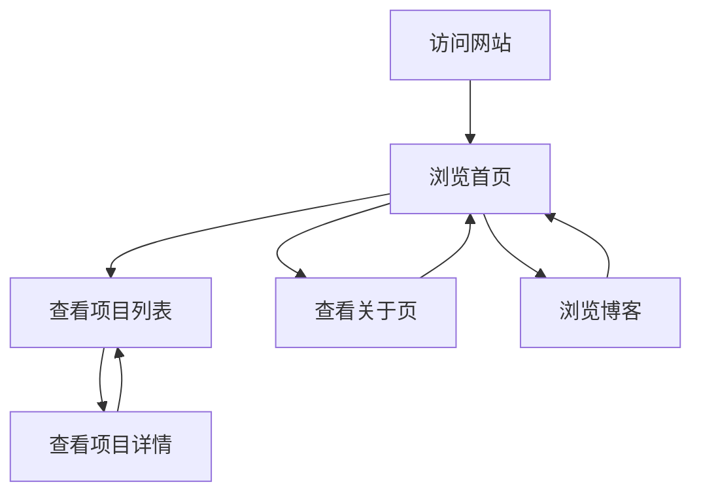

## 1. Product Overview
个人作品集网站，用于展示Python项目和学习成果，帮助用户建立个人品牌和技术展示平台。
- 主要功能包括项目展示、学习成果分享、个人简介和联系方式。
- 目标用户为招聘方、同行开发者和潜在合作伙伴。

## 2. Core Features

### 2.1 User Roles
| Role | Registration Method | Core Permissions |
|------|---------------------|------------------|
| Site Owner | No registration required | Manage content |
| Visitor | No registration required | Browse content |

### 2.2 Feature Module
1. **首页**: 个人简介、技能展示、精选项目预览、联系方式
2. **项目列表页**: 所有Python项目的卡片式展示，支持分类筛选
3. **项目详情页**: 项目详细介绍、代码展示、功能说明
4. **关于页**: 个人背景、学习历程、技术栈
5. **博客/学习笔记页**: 技术分享、学习心得

### 2.3 Page Details
| Page Name | Module Name | Feature description |
|-----------|-------------|---------------------|
| 首页 | 个人简介 | 展示个人照片、姓名、职业、简短介绍 |
| 首页 | 技能展示 | 以可视化方式展示掌握的技术栈和技能水平 |
| 首页 | 精选项目 | 展示3-5个最优秀的项目，带有简短描述和链接 |
| 首页 | 联系方式 | 提供邮箱、GitHub、LinkedIn等联系方式 |
| 项目列表页 | 项目卡片 | 每个项目以卡片形式展示，包含项目名称、简短描述、技术标签 |
| 项目列表页 | 分类筛选 | 按技术栈、项目类型等进行筛选 |
| 项目详情页 | 项目介绍 | 详细描述项目背景、功能和实现 |
| 项目详情页 | 代码展示 | 展示关键代码片段或GitHub链接 |
| 项目详情页 | 功能说明 | 说明项目的核心功能和技术亮点 |
| 关于页 | 个人背景 | 个人教育背景、工作经历 |
| 关于页 | 学习历程 | 学习路径、重要里程碑 |
| 关于页 | 技术栈 | 详细列出掌握的技术和工具 |
| 博客/学习笔记页 | 文章列表 | 展示所有技术博客和学习笔记 |
| 博客/学习笔记页 | 文章详情 | 详细的技术分享内容 |

## 3. Core Process
用户访问网站 → 浏览首页了解个人信息 → 查看项目列表 → 点击感兴趣的项目查看详情 → 阅读关于页了解背景 → 浏览博客获取技术分享

## 4. User Interface Design
### 4.1 Design Style
- 主色调: 深蓝色 (#165DFF)、浅灰色 (#F5F7FA)
- 辅助色: 橙色 (#FF7D00)、绿色 (#00B42A)
- 按钮风格: 圆角按钮，带有轻微阴影和悬停效果
- 字体: 标题使用 Inter，正文使用 Roboto
- 字体大小: 标题 24-36px，副标题 18-24px，正文 14-16px
- 布局风格: 卡片式布局，顶部导航栏，响应式设计
- 图标风格: 使用 lucide-react 提供的线性图标

### 4.2 Page Design Overview
| Page Name | Module Name | UI Elements |
|-----------|-------------|-------------|
| 首页 | 个人简介 | 左侧个人照片，右侧文字介绍，使用大标题和副标题，背景使用渐变效果 |
| 首页 | 技能展示 | 使用进度条或雷达图展示技能水平，每个技能带有图标 |
| 首页 | 精选项目 | 卡片式布局，每个卡片包含项目名称、简短描述、技术标签和链接按钮 |
| 首页 | 联系方式 | 图标+文字形式展示，带有社交平台链接 |
| 项目列表页 | 项目卡片 | 网格布局，每个卡片包含项目名称、描述、技术标签和查看详情按钮 |
| 项目列表页 | 分类筛选 | 顶部标签式筛选器，可点击切换不同分类 |
| 项目详情页 | 项目介绍 | 大标题，详细文字描述，使用卡片和分隔线组织内容 |
| 项目详情页 | 代码展示 | 代码块带有语法高亮，可复制功能 |
| 项目详情页 | 功能说明 | 使用图标+文字形式，清晰展示核心功能 |
| 关于页 | 个人背景 | 时间线形式展示教育和工作经历 |
| 关于页 | 学习历程 | 图表形式展示学习路径和里程碑 |
| 关于页 | 技术栈 | 分类展示不同技术领域的技能 |
| 博客/学习笔记页 | 文章列表 | 卡片式布局，每个卡片包含标题、发布日期、简短摘要 |
| 博客/学习笔记页 | 文章详情 | 清晰的标题层级，内容排版整洁，支持代码块和图片 |

### 4.3 Responsiveness
- 采用桌面优先设计，同时支持平板和移动设备
- 断点设置: 1200px (桌面), 768px (平板), 480px (移动设备)
- 在移动设备上，导航栏变为汉堡菜单，布局变为单列
- 图片和卡片会根据屏幕尺寸自动调整大小

### 4.4 3D Scene Guidance
- 不适用，本项目为静态展示网站，无需3D场景