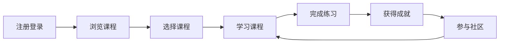

## 1. Product Overview
商务数据分析专业Python学习社区平台，提供完整课程体系、互动学习、实战练习与成就激励系统，打造师生、学长学姐与行业从业者的交流生态。

## 2. Core Features

### 2.1 User Roles
| Role | Registration Method | Core Permissions |
|------|---------------------|------------------|
| 学生 | Email/Google注册 | 浏览课程、参与练习、社区互动、查看成就 |
| 教师 | 邀请注册 | 创建课程、批改作业、回答问题、管理社区 |
| 行业从业者 | Email注册 | 分享经验、参与讨论、发布招聘信息 |

### 2.2 Feature Module
1. **首页**: 课程推荐、社区动态、学习进度展示
2. **课程体系**: 课程列表、课程详情、章节学习
3. **实战练习**: 练习列表、代码编辑器、提交评分
4. **成就系统**: 成就徽章、学习记录、排行榜
5. **社区交流**: 帖子列表、问题求解、项目分享
6. **个人中心**: 用户信息、学习统计、设置

### 2.3 Page Details
| Page Name | Module Name | Feature description |
|-----------|-------------|---------------------|
| 首页 | Hero区域 | 平台介绍、核心价值、快速入门按钮 |
| 首页 | 课程推荐 | 基于进度的个性化课程推荐卡片 |
| 首页 | 社区动态 | 最新帖子、热门讨论实时展示 |
| 课程列表页 | 分类导航 | 按难度、主题分类浏览课程 |
| 课程详情页 | 课程大纲 | 章节结构、学习时长、难度标签 |
| 课程详情页 | 学习进度 | 已完成章节、进度百分比 |
| 实战练习页 | 练习列表 | 按难度分类的练习题目 |
| 实战练习页 | 代码编辑器 | Monaco代码编辑器、实时运行 |
| 成就页 | 徽章展示 | 成就分类、已获得/未获得状态 |
| 成就页 | 排行榜 | 学习时长、完成度排行 |
| 社区页 | 帖子列表 | 热门帖子、最新问题、项目分享 |
| 社区页 | 发帖功能 | 发布问题、分享项目 |
| 个人中心 | 学习统计 | 可视化学习数据图表 |
| 个人中心 | 用户信息 | 编辑个人资料、设置偏好 |

## 3. Core Process
用户注册→浏览课程→选择学习→完成练习→获得成就→参与社区→持续进步

## 4. User Interface Design
### 4.1 Design Style
- **主色调**: 深蓝色 (#1e3a5f) - 专业、信任
- **辅助色**: 金色 (#f59e0b) - 成就、激励
- **强调色**: 青色 (#06b6d4) - 科技、现代
- **按钮风格**: 圆角矩形，悬浮有阴影和微动画
- **字体**: Playfair Display（标题）+ Source Sans Pro（正文）
- **布局风格**: 卡片式布局，清晰的视觉层次
- **图标风格**: Lucide图标，简洁线条风

### 4.2 Page Design Overview
| Page Name | Module Name | UI Elements |
|-----------|-------------|-------------|
| 首页 | Hero区域 | 渐变背景、大标题、副标题、CTA按钮、动画效果 |
| 首页 | 课程卡片 | 缩略图、标题、难度标签、进度条、卡片悬停效果 |
| 课程详情 | 课程信息 | 大缩略图、标题、描述、教师信息、评分展示 |
| 实战练习 | 代码编辑器 | Monaco编辑器、控制台输出、提交按钮、代码高亮 |
| 成就页 | 徽章墙 | 网格布局、徽章动画、解锁进度、tooltip提示 |
| 社区页 | 帖子卡片 | 用户头像、标题、摘要、互动统计、标签 |

### 4.3 Responsiveness
- Desktop-first设计，支持平板和移动端适配
- 响应式断点：1024px、768px、480px
- 触摸友好的交互设计，按钮最小尺寸48px
- 移动端采用抽屉式导航菜单

### 4.4 交互与动画
- 页面加载时的淡入动画
- 卡片悬浮时的上浮和阴影加深
- 成就解锁时的庆祝动画
- 平滑滚动和页面切换过渡
