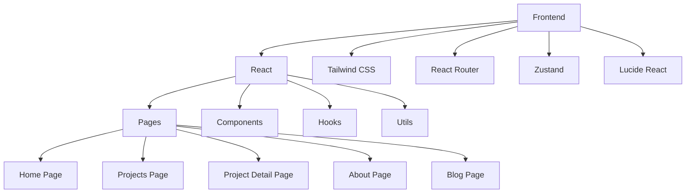

## 1. Architecture Design


## 2. Technology Description
- Frontend: React@18 + tailwindcss@3 + vite
- Initialization Tool: vite-init
- Backend: None (静态网站)
- Database: None (使用静态数据)
- Deployment: GitHub Pages / Vercel

## 3. Route Definitions
| Route | Purpose |
|-------|---------|
| / | Home page with personal intro, skills, and featured projects |
| /projects | Projects list page with filtering |
| /projects/:id | Project detail page with description and code |
| /about | About page with personal background and skills |
| /blog | Blog page with technical articles |
| /blog/:id | Blog post detail page |

## 4. API Definitions
- 不适用，本项目为静态网站，无需API

## 5. Server Architecture Diagram
- 不适用，本项目为静态网站，无后端服务器

## 6. Data Model
- 不适用，本项目使用静态数据，无需数据库

### 6.1 Data Model Definition
- 项目数据结构:
  ```typescript
  interface Project {
    id: string;
    name: string;
    description: string;
    tags: string[];
    image: string;
    link: string;
    github?: string;
    details: string;
    codeSnippets: string[];
  }
  ```
- 博客文章数据结构:
  ```typescript
  interface BlogPost {
    id: string;
    title: string;
    date: string;
    summary: string;
    content: string;
    tags: string[];
  }
  ```
- 技能数据结构:
  ```typescript
  interface Skill {
    name: string;
    level: number; // 0-100
    category: string;
    icon: string;
  }
  ```

### 6.2 Data Definition Language
- 不适用，本项目使用静态数据，无需数据库